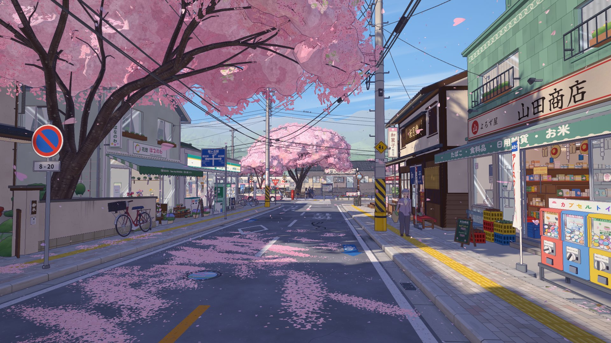
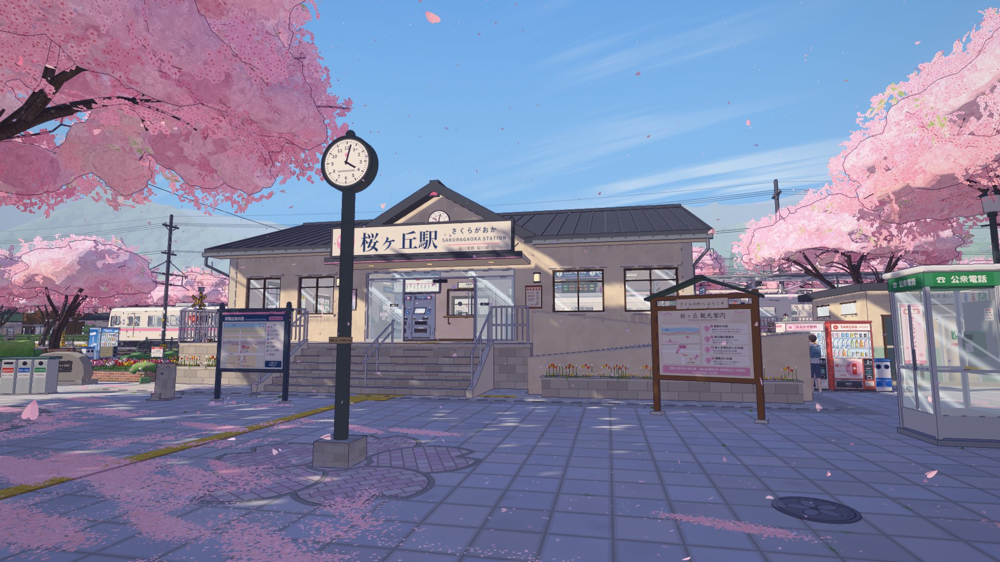
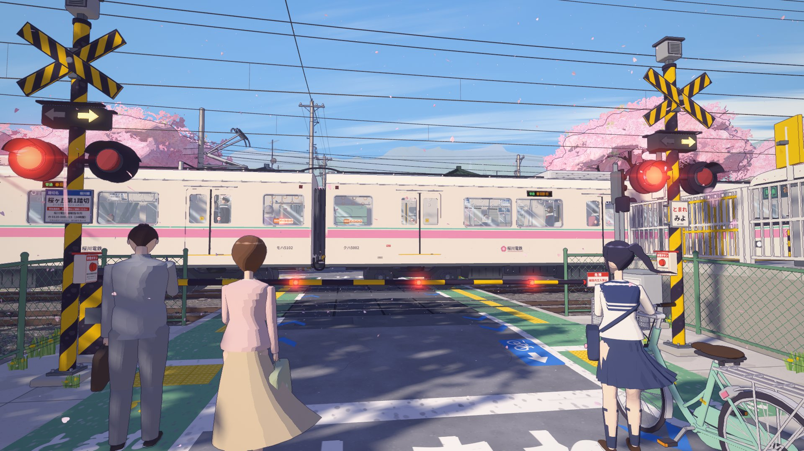
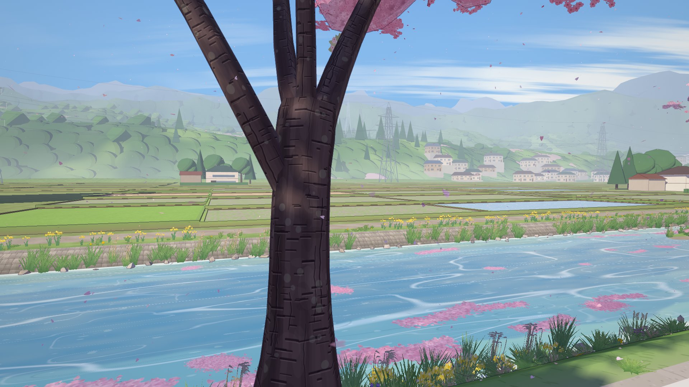
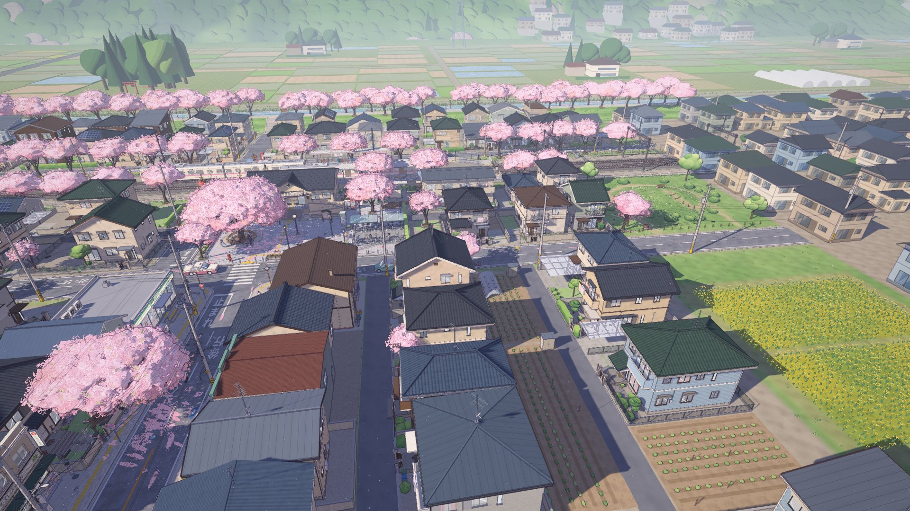
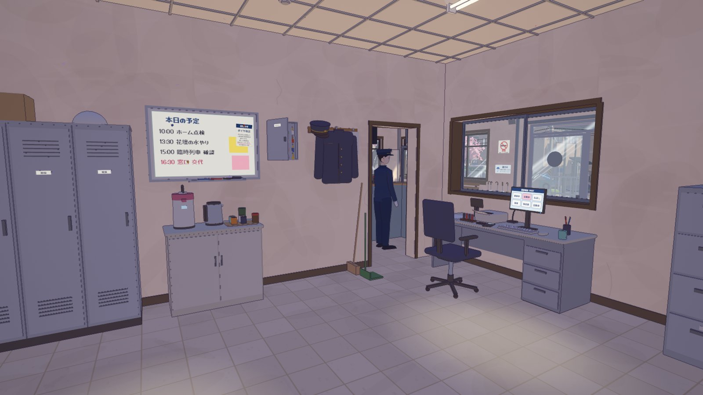
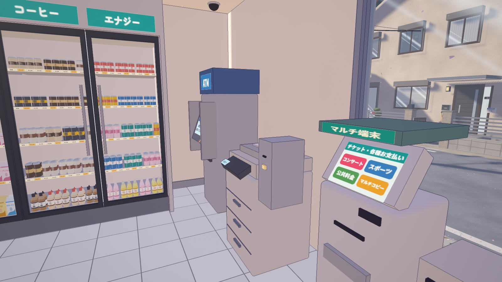

# 桜ヶ丘駅 · Sakuragaoka Station

A walkable, first-person **anime cel-shaded Japanese suburban sakura station** built with plain [three.js](https://threejs.org/) — no build step, no external 3D assets. Everything (buildings, trains, trees, signage, textures, sound) is generated procedurally in code.



| | |
|---|---|
|  |  |
|  |  |
|  |  |

## Features

- **Cel-shaded look** – toon ramp materials, screen-space colour-aware outlines, blue-violet shadows, bloom, film grading, light leaks, painted sky with wind-stretched clouds.
- **A whole small town** – station building with a fully modelled interior and office, two platforms, a level crossing with working barriers and bells, a shopping street (konbini, café, flower shop, bookstore, wagashi shop, ramen shop, general store, bicycle shop — all enterable and furnished), houses, a shrine, a river levee lined with cherry trees, distant fields and mountains.
- **Living scene** – two trains on a 2-minute timetable (arrive, open doors, depart through the crossing), falling petals with wind and train gusts, petal drifts and petal rafts on the river, townspeople, cats and sparrows.
- **Synthesized audio** – wind, birds, crossing bell, train motors and rail joints, door chimes, a departure melody — all WebAudio, no sound files.
- **Performance** – automatic static batching (vertex-colour material merging + texture atlasing); ~4 M triangles at 60+ fps on a desktop GPU.

## Run

Serve the folder with any static file server, e.g. the bundled one:

```bash
node tools/serve.mjs
```

Then open <http://localhost:5173>. An internet connection is needed for three.js and fonts (loaded from jsDelivr / Google Fonts). Any static file server works too — ES modules just need to be served over HTTP, not `file://`.

### Controls

| Key | Action |
|---|---|
| Mouse | Look (click to lock pointer) |
| W A S D / arrows | Walk |
| Shift | Run |
| Space | Jump |
| F | Toggle fly mode |
| 1 – 5 | Jump to Street / Plaza / Platform / Crossing / Levee |
| H | Hide UI |
| M | Mute |

Touch: drag the left side to walk, the right side to look. Graphics quality can be changed in the top-right corner.

## Project layout

```
index.html              entry page (import map → three@0.170.0 on jsDelivr)
src/main.js             bootstrap, module loading, main loop, HUD
src/core/               renderer & post-processing, toon materials, sky & lights,
                        physics, first-person player, batching, wires, audio
src/world/layout.js     world contract: coordinates, roads, lots, spots, timetable
src/world/<module>.js   scene modules: environment, street, poles, railway, station, plaza,
                        shopsA, shopsB, houses, sakura, trains, crossing, props,
                        vehicles, characters, petals (+ helper folders of the same name)
src/world/lib/          shared generators (smooth cel-shaded foliage)
tools/                  dev server, headless checks & screenshots
docs/DESIGN.md          architecture / module contract
```

### Development tools

```bash
npm install                       # three + puppeteer-core, only needed for the tools below
node tools/check.mjs station      # headless build check of one or more modules (no GPU)
node tools/shot.mjs --cams "1.6,34,4,2" --out shots/test --t 22   # GPU screenshots via headless Edge/Chrome
node tools/audio-test.mjs         # offline render test of every synthesized sound
```

URL parameters: `?only=station,plaza` (build a subset), `?t=40` (start time), `?q=medium` (quality), `?stats` (fps counter), `?fly`.

## License

[MIT](LICENSE). All brands, stations and place names in the scene are fictional.
